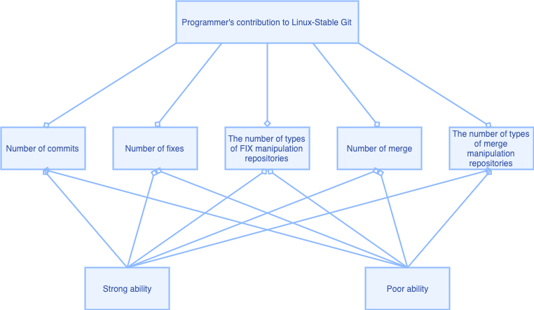

# **A programmer utility evaluation model based on the number of operations of the Linux stable library**

## I. Group information

- ZhaoHaoran(320180940621)
- LinGuoxi(320180939981)
- ZhaiZhaoyuan(320180939661)
- CaoShuhai(320180939551)
- MiaoYan(320180940711)
- XuJiale(320180940401)
- LiuYueze(320180940071)
- LiYichen(320180939961)

## II. Project thinking process

​		Since there is no parameter in linux-stable that can indicate the quality of the code, or a tag, we try to define ourselves as a programmer's ability. We build a nonlinear regression model ourselves to represent a person's ability, referred to as Weights. Through this weights, we try to use the personnel in V4 to generate the weights table, and use these data to verify and search our hypothesis, *use time zone to judge programmer level to judge code level*, and calculate the statistical value to verify .

​		We mainly use the git package in python for operation, and perform CSV data storage and data visualization, packaging and upgrade. Since some calculations in the middle part are just calculation formulas, we directly use the calculator to check the statistical results.

## III. Model

###1 Problem Analysis

​		This model belongs to a link in the project. The overall project is based on the programmer's technical strength to analyze the code, and the establishment of this model is used to analyze the strength of the programmer.

### 2 Model assumption

1. Assuming that the data in this model is true and effective. 

2. For this problem, ignore other irrelevant factors, that is, only use the collected data to analyze the utility of the programmer.

### 3 Symbol description

| Symbol  |           Meaning           |
| :-----: | :-------------------------: |
|    U    |        Utility value        |
|    V    | Utility value determination |
|    W    |           Weights           |
| $C_{i}$ |      Consistency index      |
| $R_{i}$ |  Random consistency index   |
| $C_{R}$ |      Test coefficient       |

### 4 Model establishment and solution

#### 4.1 Definition of benefits

​		To judge the contribution and technical strength of a programmer by the number of operations of linux stable, it is necessary to quote the concept of utility value. Judging the skill level of programmers based on the amount of operations often upholds the principle of "Utility" maximization. We define the utility of programmer i under the contribution of linux stable as 𝑈𝑖, 𝑈𝑖 is called the "utility value" of programmer i's contribution. This programmer has a higher technical definition than another programmer:
$$
U_{m}>U_{n}, m \neq n, m \in A, n \in A
$$
​		According to the theory of random utility, the utility value is a random variable, which is composed of a fixed term $𝑉_{i}$ and a random term $𝜀_{i}$
$$
\mathrm{V}_{i}=\sum_{k=1}^{n} \theta_{k} X_{i k} \quad(i \in A)
$$
​		In this formula,  $X_{ik}$ is the value of the k-th characteristic variable of programmer i, and $𝜃_{k}$ is the unknown parameter corresponding to the k-th variable. According to the weight corresponding to each characteristic variable value, the corresponding parameter $𝜃_{k}$ can be obtained. Combining the parameters of each indicator and the internal relationship between the indicators and applying the method of multi-objective decision-making, the total utility $U_{j}$ of these indicators can be obtained. Here, we select the number of commit operations, the number of fix operations, the number of types of fix operations, the number of merge operations, and the number of merge operations of the programmer to the linux stable library as five characteristic variables to measure the effectiveness of a programmer. 

​		Among them, the number of commit operations, the number of fix operations, the number of types of fix operation libraries, the number of merges, and the number of types of merge operations take the actual value of the changes made by the programmer as the value of the characteristic variable.

#### 4.2 Solution of utility function

​		The solution of the utility function is divided into two parts: the solution of the five characteristic variables and the determination of the corresponding coefficient. The data required to calculate the characteristic variable of programmer i can be obtained by data crawling on linux stable, and the value of the characteristic variable is substituted. The coefficients corresponding to the characteristic variables can be obtained by AHP.

​		Apply AHP to determine the coefficient:

​		The highest level is the target level, which is evaluating the programmer's contribution to linux stable.

​		The middle layer is the criterion layer, that is, five indicators to measure the operation of the programmer.

​		The bottom layer is the program layer, that is, the strength analysis of the programmer.

​		Since there are mainly four items for programmers, an evaluation matrix is made for the five indicators of the number of commit operations, the number of fix operations, the number of types of fix operation libraries, the number of merges, and the number of types of merge operations. Through the survey, the number of commit operations, the number of fix operations, the number of types of fix operation libraries, the number of merges, and the number of types of merge operations are important in the minds of experts, and the evaluation metrics of the evaluation matrix are given:

|          Factor i withx factor j           |    x    |
| :----------------------------------------: | :-----: |
|             Equally important              |    1    |
|             Slightly important             |    3    |
|             Stronger important             |    5    |
|             Strongly important             |    7    |
|            Extremely important             |    8    |
| The median value of two adjacent judgments | 2, 4, 6 |

​		After the evaluation matrix of the four indicators is obtained, the weights of the four indicators when determining the transportation mode are determined by pairwise comparison, and the following comparison moments are obtained (from top to bottom, from left to right, the indicators are the number of commit operations, the fix operation Number, number of types of fix operation library, number of merge, number of types of merge operation)

​				1，     4，     5，     7，     8

​				1/4， 1，     2，     5，     8

​				1/5， 1/2，  1，    7，      4

​				1/7， 1/5，  1/7， 1，     2

​				1/8， 1/4 ， 1/8， 1/2，  1

​		Using the sum product method to calculate the weight W is:
$$
W=(0.0297,0.0669,0.1011,0.3423,0.4599)^{T}
$$
​		Perform consistency check, the largest feature vector:
$$
\lambda_{\max }=6.0600
$$
​		Calculated from this 𝐶𝑖, 𝑅𝑖:
$$
C_{i}=0.1 .27 \quad R_{i}=1.120
$$
​		Then		
$$
C_{R}=0.091696<0.10
$$
​		Since CR<0.1, the inconsistency of the passenger survey is acceptable, and the obtained weight coefficient can be used.

​		In summary: 
$$
W=(0.0297,0.0669,0.1011,0.3423,0.4599)^{T}
$$

#### 4.3 Solution of utility value

​		It can be obtained through the above two parts of analysis that the five index values are the number of commit operations, the number of fix operations, the number of types of fix operations libraries, the number of merges, and the number of types of merge operations using actual data obtained through the python crawler technology.

​		The weight coefficient uses the data calculated by the second part using the analytic hierarchy process, and then is substituted into the formula of the utility function to obtain the final utility value.

​		The utility value will be given through the CSV table, so far all the utility quantification is completed, that is, each programmer will quantify the contribution of the linux stable library.

## IV. Grap and preprocess the data 

### 1  **Data capture**

​		Grab all the information submitted by all users in the Linux-stable when they commit in Git. (Contents include: User name and its mailbox, time, time zone, remark information and other kinds of information.)

**Specific steps:**

1. Using PythonGit to unpack every commit information of users in Git.
2. Then, Using PythonGit and split () to split all the commits to get the specific information. 
3. The information in each commit is stored in the form of dictionary, and all dictionaries are stored in a list. 
4. Each item in the list is a dictionary. Export the processed information to MySQL library, or export it as CSV file.

### 2 Data preprocessing

​		Make statistics on the captured data according to certain standards. There are five specific standards:

1. Total commits per person.
2. Total number of “Fix” operations per person.
3. Number of different commits per person has fixed.
4. Number of merges per person.
5. Number of different libraries each person has merged.

​		The number of commits simply reflects a person's contribution to the content growth of the library and the time spent on the library. For an operating system, the vulnerabilities in the underlying code can sometimes determine the success or failure of an operating system, and it is essential to have the ability to identify the errors that may occur in each commit, which can reflect the knowledge and strong professional ability of the submitter for the operating system itself. For git warehouse, not everyone has merge permission, which involves merging different branches. The number of merge can reflect the identification ability of the submitter and the overall understanding of the operating system. So we can see the individual ability of the submitter and the whole operating system through the number of these operations.

​		These five statistics will be used as input data in the following model analysis.

​		After data preprocessing, we get the specific values of these five standards, and put them into the established mathematical model for analysis. After analysis, we get a value that can quantify each person's specific ability, which we call the ability index. Based on the time zone, we get the sum and average of the ability index of all people in each time zone, so as to judge whether there is an obvious relationship between the professional ability of engineers and the time zone.

## V. Fit and conclusion

​		We select the commit, fix, merge operations and other data of each author in the Linux library as indicators, use Python to automatically capture and count them, 
and then use these indicators to give each author an index to measure their contribution to the Linux library through modeling. Then, the authors are grouped according to their time zone, 
and their contribution index is summed to get the sum of the contributions of engineers to Linux Library in each time zone.

​		The main continents of the world are divided into two parts: the United States to the east coast of the Atlantic Ocean and Europe to the east coast of Eurasia. 
​		In these two parts, the contribution of engineers to Linux library gradually decreases from west to East. The decreasing trend from the United States to the east coast of the Atlantic Ocean is obvious, and the correlation coefficient is - 0.71. The decreasing trend from Europe to the east coast of Eurasia is not obvious, and the correlation coefficient is - 0.58.

## VI. Check results

​		From the perspective of the world map, to be honest, we don’t have high self-confidence in this model, but in the end, we found a general rule that the world is divided into two parts with Europe as the boundary, and each part contributes to linux The amount is gradually decreasing from west to east, The correlation coefficient is around 0.6. This may indicate that human capabilities are partially related to the region, but we have no idea how to derive downwards, and we don’t know whether our model process is wrong.

ps. We also found an interesting fact. From the map, it is true that the contribution of developers in economically developed areas is relatively high, such as the East Coast of the United States, China, Japan, and South Korea.

## VII Feelings

​		We tried a variety of methods and processes to consider this "impossible" task, so we also made this result that we don't know if it is correct. The project process is still very interesting. Everyone came up with their strange but brilliant ideas. Of course, we gave up because we couldn't realize it. The difficulty this time is that it is impossible to accurately judge the programmer's ability or code quality. We tried to quantify him and achieve comparison with them, which gave us valuable experience.